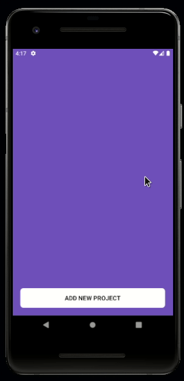

<h1 align="center">API - NodeJS, React, React-Native and TypeScript</h1>

<h2>:computer: About</h2>
This project was developed to create an API possible to integrate with front-end (React) and mobile (React-Native). There is also a version using TypeScript.

---

<h2>:toolbox: What did I use?</h2>

- Javascript;
- [NodeJS](https://nodejs.org/en/)
- [Express](https://expressjs.com/)
- [React](https://reactjs.org/)
- [React-Native](https://reactnative.dev/)
- [Axios](https://github.com/axios/axios)
- [TypeScript](https://www.typescriptlang.org/)

---

<h2>:man_technologist: Features</h2>
<ul>
<li>filter(), map(), push();</li>
<li>HTTP Methods;</li>
<li>HTTP Parameters;</li>
<li>HTTP Status Code;</li>
<li>async/await;</li>
<li>Hook Effect;</li>
<li>Integration with a external API;</li>
<li>React-Native stylization</li>
</ul>

---

<h2>:heavy_check_mark: Check the project</h2>

#### Initializing API (back-end)
```bash
# Step 1 (clone the repository):

$ git clone https://github.com/victorfclima/nodejs-api.git
$ cd backend

# Step 2 (install the dependencies):

$ yarn

# Step 3 (run the server):

$ yarn dev

# Step 4 (check with insomnia or postman)
```


---

#### Initializing React (front-end)
```bash
# Step 1 (acess the front-end folder):

$ cd ..
$ cd frontend

# Step 2 (install the dependencies):

$ yarn

# Step 3 (run the server):

$ yarn dev

# Step 4 (Open your browser at)

http://localhost:8080/
```


---

#### Initializing React-Native (mobile)
```bash
# Step 1 (acess the mobile folder):

$ cd ..
$ cd mobile

# Step 2 (install the dependencies):

$ yarn

# Step 3 (run the server):

$ yarn start

# Step 4 (Open your android emulator, like android studio and enter):

yarn android
```




